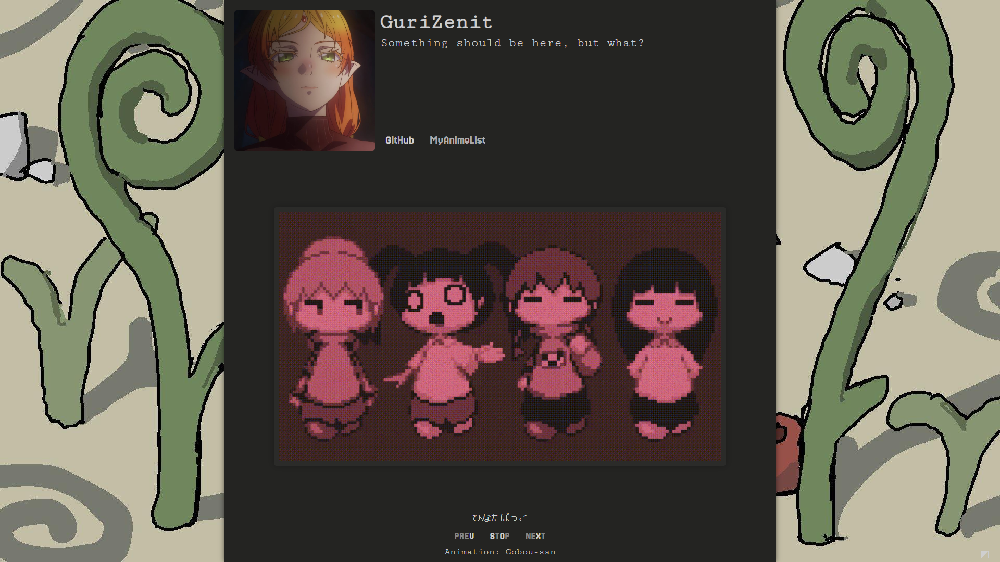
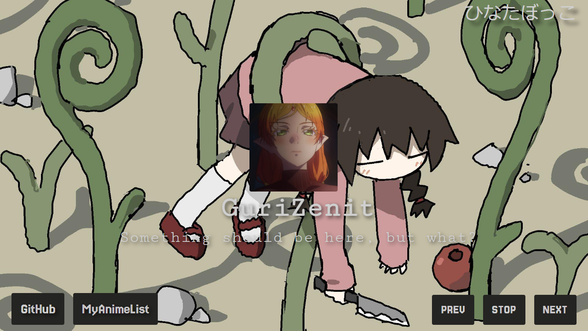
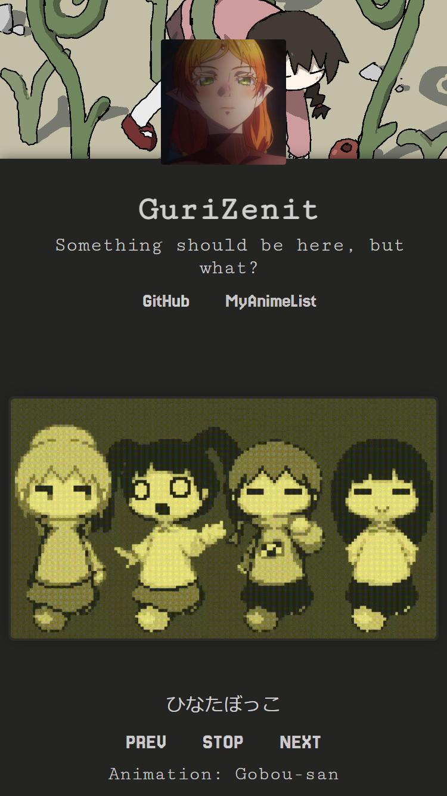

# Yume

## Description
Yume is a personal profile site, I did it because I was bored, and I like the game Yume Nikki. [preview](https://gurizenit.github.io/yume-site/)

## Preview Images

  <h3>Desktop</h3>
  

    
  

  <h3>Mobile</h3>
  

    
    
  

## Technologies Used
- HTML
- CSS
- JavaScript

## License
MIT [LICENSE](LICENSE)